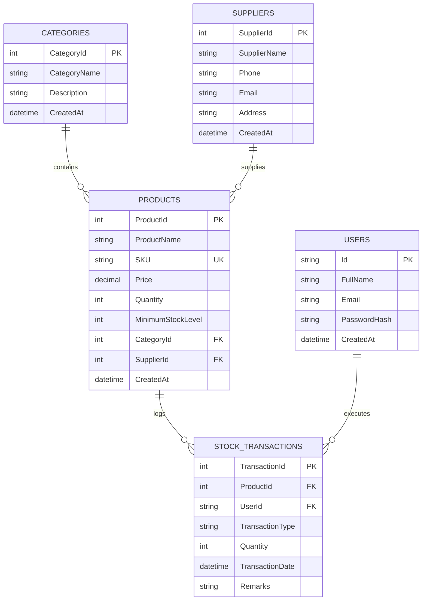
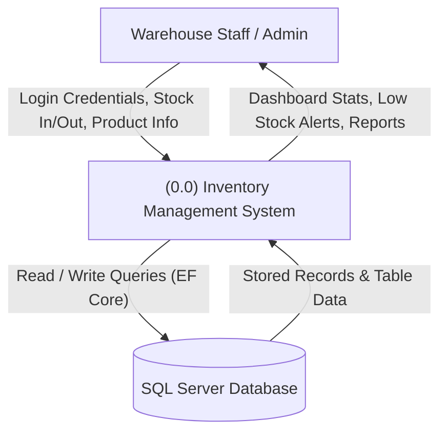
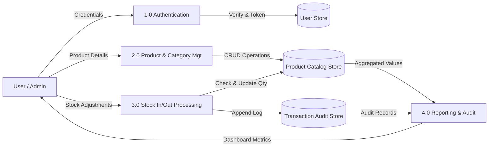
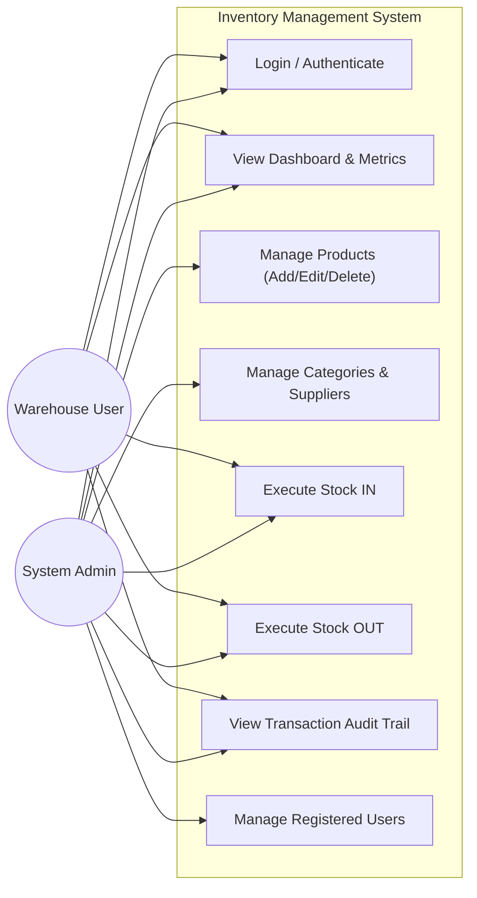

# A MAJOR PROJECT REPORT ON
# INVENTORY MANAGEMENT SYSTEM (IMS)

**Submitted in Partial Fulfillment of the Requirements for the Award of the Degree of**  
**BACHELOR OF COMPUTER APPLICATIONS (BCA)**

---

## 1. COVER PAGE

**PROJECT TITLE:** Inventory Management System (IMS)  
**SUBMITTED BY:** [Student Name]  
**UNIVERSITY ROLL NO:** [Roll Number]  
**COLLEGE / INSTITUTION:** [College Name]  
**DEPARTMENT:** Department of Computer Applications  
**ACADEMIC YEAR:** 2025 – 2026  

---

## 2. CERTIFICATE

This is to certify that the project entitled **"Inventory Management System (IMS)"** submitted by **[Student Name]** (Roll No: **[Roll Number]**) in partial fulfillment of the requirements for the award of the degree of **Bachelor of Computer Applications (BCA)**, is an authentic record of bonafide project work carried out under my supervision and guidance.

To the best of my knowledge, the matter embodied in this project report has not been submitted to any other University or Institute for the award of any degree or diploma.

**Project Guide / Mentor:**  
Signature: ___________________________  
Name: [Guide Name]  
Designation: Assistant Professor / Project Coordinator  
Department of Computer Applications  

**Head of Department (HOD):**  
Signature: ___________________________  
Name: [HOD Name]  
Department of Computer Applications  

---

## 3. DECLARATION

I hereby declare that the project work entitled **"Inventory Management System (IMS)"** submitted to the Department of Computer Applications, is an original work done by me under the guidance of **[Guide Name]**.

I further declare that this report has not been submitted previously in whole or in part to any other university or institution for the award of any academic degree, diploma, or fellowship.

**Date:** [Date]  
**Place:** [City]  
**Signature of Student:** ___________________________  
**Name:** [Student Name]  
**Roll No:** [Roll Number]  

---

## 4. ACKNOWLEDGEMENT

I express my deepest sense of gratitude to my esteemed project guide, **[Guide Name]**, for his/her invaluable guidance, patient mentoring, and constructive criticism throughout the duration of this Major Project.

I also extend my sincere thanks to the Head of the Department, **[HOD Name]**, and all faculty members of the Department of Computer Applications for providing the requisite infrastructure, laboratories, and academic support.

Lastly, I thank my family and fellow classmates for their moral encouragement and continuous cooperation which enabled me to complete this project successfully.

---

## 5. ABSTRACT

In contemporary commerce and supply chain management, managing warehouse stock levels efficiently and accurately is critical to business sustainability. Traditional manual registers and disconnected spreadsheets frequently suffer from human calculation errors, delayed stock status updates, lack of auditability, and stock-outs.

The **Inventory Management System (IMS)** is a modern, full-stack, enterprise-grade web application developed to automate warehouse inventory tracking. The system is engineered using a robust 3-tier client-server architecture:
- **Frontend Layer:** Responsive, accessible web user interface built with HTML5, CSS3, JavaScript (ES6+), and Bootstrap 5.
- **Application & API Layer:** High-performance RESTful Web APIs built on **ASP.NET Core 8** (C#) enforcing secure token-based authentication (JWT) and role-based access control (Admin and User roles) via ASP.NET Core Identity.
- **Data Access & Storage Layer:** **Entity Framework Core 8** Code-First Object-Relational Mapper (ORM) coupled with **Microsoft SQL Server**.

Key capabilities include automated real-time financial inventory valuation, multi-criteria product search and filtering, category and supplier relationship tracking, atomic Stock IN and Stock OUT operations with strict negative-quantity rejection validation, and an immutable transaction audit log.

---

## 6. TABLE OF CONTENTS

1. Cover Page
2. Certificate
3. Declaration
4. Acknowledgement
5. Abstract
6. Table of Contents
7. Introduction
8. Problem Statement
9. Existing System
10. Limitations of Existing System
11. Proposed System
12. Objectives
13. Scope
14. Features
15. Technology Used
16. Hardware Requirements
17. Software Requirements
18. Functional Requirements
19. Non-Functional Requirements
20. System Architecture
21. Module Description
22. Database Design
23. ER Diagram
24. DFD Level 0
25. DFD Level 1
26. UML Diagrams
27. API Description
28. Screenshots
29. Testing
30. Test Cases
31. Results
32. Advantages
33. Limitations
34. Future Scope
35. Conclusion
36. References

---

## 7. INTRODUCTION

Inventory represents one of the largest capital investments for retail, manufacturing, and wholesale businesses. An Inventory Management System oversees the ordering, storage, tracking, and issuance of goods. 

This project, **Inventory Management System (IMS)**, provides an automated, centralized digital platform that bridges warehouse stock management with administrative oversight. It eliminates paper registers, prevents over-issuance, and provides management with instantaneous visibility over total inventory financial valuation and re-ordering needs.

---

## 8. PROBLEM STATEMENT

Manual inventory tracking in growing businesses faces severe operational bottlenecks:
1. **Human Calculation Errors:** Manual stock counting and ledger entries lead to discrepancy between actual physical stock and register records.
2. **Negative Stock Issues:** Goods are issued on paper without verifying actual shelf availability, resulting in fulfillment failures.
3. **Lack of Re-Order Visibility:** Stock-outs happen abruptly because there are no automated thresholds signaling low inventory.
4. **Zero Auditability:** Difficult to track which staff member authorized a receipt or issued stock.
5. **No Realtime Financial Valuation:** Calculating total capital tied up in inventory requires hours of manual math across multiple spreadsheets.

---

## 9. EXISTING SYSTEM

In many medium and small enterprises (SMEs), inventory operations are managed via:
- Physical paper logbooks and receipt slips.
- Standalone Microsoft Excel sheets on individual computers.
- Verbal communication between warehouse keepers and sales personnel.

---

## 10. LIMITATIONS OF EXISTING SYSTEM

- **Data Redundancy & Inconsistency:** Excel sheets stored on different computers get out of sync.
- **No Concurrency Control:** Simultaneous edits cause data overwriting.
- **Absence of Role Security:** Anyone opening the register or spreadsheet can alter numbers without authentication.
- **Vulnerability to Loss:** Physical registers can be lost, damaged, or manipulated.
- **Slow Querying:** Searching for historical receipts from 6 months ago takes hours of manual page-turning.

---

## 11. PROPOSED SYSTEM

The proposed **Inventory Management System (IMS)** addresses all limitations through a web-based, multi-user centralized architecture:
- Single source of truth backed by a Microsoft SQL Server database.
- Centralized REST APIs handling business validation (e.g., stopping negative balance operations).
- Role-based security ensuring only authorized personnel modify records.
- Automated threshold badges tagging items as *In Stock*, *Low Stock*, or *Out of Stock*.
- Complete historical audit log timestamping every stock movement.

---

## 12. OBJECTIVES

1. Develop a responsive, user-friendly web interface accessible across desktop and mobile browsers.
2. Build secure, decoupled RESTful APIs using ASP.NET Core 8 and C#.
3. Implement Entity Framework Core Code-First design with automatic schema migrations.
4. Enforce strict stock balance rules preventing negative inventory.
5. Provide real-time financial valuation and management metrics via an interactive dashboard.
6. Implement secure authentication, password hashing, and role authorization via ASP.NET Core Identity and JWT tokens.

---

## 13. SCOPE

The system is designed for small to medium enterprise warehouses, distribution hubs, retail back-offices, and academic inventory centers. It covers catalog management, vendor contacts, inward and outward material movement, and historical transaction auditing.

---

## 14. FEATURES

- **Landing Page:** Public showcase with live warehouse stats overview.
- **Identity & Access Control:** Secure user registration, login, role separation (Admin / User), and password hashing.
- **Executive Dashboard:** Live metrics for total products, categories, suppliers, stock count, valuation, and re-order alerts.
- **Product Catalog:** Multi-field product creation with unique SKU enforcement, price formatting, and category/vendor links.
- **Search & Filtering:** Real-time query filtering by keyword, category, and stock health status.
- **Vendor Directory:** Supplier profile tracking (contact number, email, address).
- **Category Classification:** Grouping items into organized business categories.
- **Stock In / Stock Out Engine:** Atomic addition and deduction with negative stock rejection.
- **Audit Log:** Complete date-timestamped history with operator username and transaction remarks.

---

## 15. TECHNOLOGY USED

| Layer | Technology | Version | Purpose |
| :--- | :--- | :--- | :--- |
| **Frontend UI** | HTML5, CSS3, JavaScript (ES6+) | Modern | Visual presentation, user interaction |
| **CSS Framework** | Bootstrap | 5.3.3 | Responsive grid, cards, modals, form controls |
| **Icons** | Bootstrap Icons | 1.11.3 | Visual UI iconography |
| **Backend API** | ASP.NET Core Web API (C#) | 8.0 LTS | RESTful endpoints, business logic, validation |
| **Data Access** | Entity Framework Core | 8.0.8 | Code-First ORM, LINQ queries, Migrations |
| **Database** | Microsoft SQL Server | 2022 Express | Relational tables, foreign keys, ACID compliance |
| **Security** | ASP.NET Core Identity + JWT | 8.0.8 | PBKDF2 password hashing, Bearer tokens, Roles |
| **API Docs** | Swagger / OpenAPI | 6.6.2 | Interactive API documentation and testing |

---

## 16. HARDWARE REQUIREMENTS

- **Processor:** Intel Core i3 / AMD Ryzen 3 or higher.
- **RAM:** Minimum 4 GB (8 GB recommended).
- **Hard Disk Space:** Minimum 10 GB free space for database and development runtimes.
- **Display:** Standard 1366 x 768 or Full HD 1920 x 1080 display.

---

## 17. SOFTWARE REQUIREMENTS

- **Operating System:** Windows 10 / 11 (64-bit).
- **SDK & Runtime:** .NET 8.0 SDK (v8.0.425).
- **Database Engine:** Microsoft SQL Server 2022.
- **Database Management Tool:** SQL Server Management Studio (SSMS) 20.
- **Web Browser:** Google Chrome / Microsoft Edge.
- **Editor / IDE:** Visual Studio 2022 / Visual Studio Code.

---

## 18. FUNCTIONAL REQUIREMENTS

- **FR1 (Authentication):** Users must authenticate with valid credentials before accessing administrative actions.
- **FR2 (Product Management):** Authorized users can create, read, update, and delete products with unique SKU codes.
- **FR3 (Category Management):** System supports adding and maintaining item categories.
- **FR4 (Supplier Management):** System stores supplier records and links them to products.
- **FR5 (Stock In):** Warehouse operators can record received goods, automatically increasing inventory.
- **FR6 (Stock Out):** Warehouse operators can issue goods, automatically decreasing inventory only if sufficient stock exists.
- **FR7 (Audit Trail):** Every stock modification must append a permanent log in the `StockTransactions` table.
- **FR8 (Dashboard Analytics):** System must aggregate total inventory value ($\sum P \times Q$) and count low-stock items.

---

## 19. NON-FUNCTIONAL REQUIREMENTS

- **Security:** Passwords hashed with PBKDF2; JWT tokens expire after designated timeframe; parameterized queries prevent SQL Injection.
- **Performance:** Database reads complete in under 50 milliseconds via indexed foreign keys and SKU columns.
- **Usability:** Clean, intuitive Bootstrap UI requiring minimal user training.
- **Reliability:** ACID transactions guarantee that stock changes and audit logs either commit together or roll back on error.
- **Maintainability:** Clean folder separation (Controllers, Models, DTOs, Services) adheres to SOLID principles.

---

## 20. SYSTEM ARCHITECTURE

```
┌────────────────────────────────────────────────────────┐
│                   CLIENT BROWSER                       │
│    HTML5  +  CSS3  +  Bootstrap 5  +  JavaScript       │
└───────────────────────────┬────────────────────────────┘
                            │ HTTP JSON Requests
                            ▼
┌────────────────────────────────────────────────────────┐
│               ASP.NET CORE 8 WEB API                   │
│   Controllers  •  DTOs  •  JWT Auth  •  Identity       │
└───────────────────────────┬────────────────────────────┘
                            │ LINQ Queries
                            ▼
┌────────────────────────────────────────────────────────┐
│             ENTITY FRAMEWORK CORE 8 (ORM)              │
│      ApplicationDbContext  •  Model Configurations     │
└───────────────────────────┬────────────────────────────┘
                            │ Parameterized SQL
                            ▼
┌────────────────────────────────────────────────────────┐
│              MICROSOFT SQL SERVER 2022                 │
│   Categories • Products • Suppliers • Transactions     │
└────────────────────────────────────────────────────────┘
```

---

## 21. MODULE DESCRIPTION

1. **Authentication & Authorization Module:** Manages user registration, JWT generation, password validation, and role assignment (`Admin`, `User`).
2. **Dashboard Module:** Aggregates real-time metrics, valuation calculations, and re-order threshold alerts.
3. **Product Management Module:** Handles CRUD operations, SKU validation, price formatting, and category/supplier assignments.
4. **Category Module:** Allows classification of items and counts associated products.
5. **Supplier Module:** Stores vendor contacts and tracks vendor-supplied product portfolios.
6. **Stock In/Out Engine:** Implements atomic stock additions and deductions, enforcing the negative stock prevention rule.
7. **Audit & Reporting Module:** Provides queryable transaction logs with date, user, quantity, and reason notes.

---

## 22. DATABASE DESIGN

The relational schema comprises normalized tables connected via primary and foreign key constraints:

### 1. Categories Table (`dbo.Categories`)
| Column | Type | Constraints | Description |
| :--- | :--- | :--- | :--- |
| `CategoryId` | INT | PK, Identity(1,1) | Unique category identifier |
| `CategoryName` | NVARCHAR(MAX) | NOT NULL | Category name |
| `Description` | NVARCHAR(MAX) | NULL | Optional details |
| `CreatedAt` | DATETIME2 | NOT NULL | Timestamp |

### 2. Suppliers Table (`dbo.Suppliers`)
| Column | Type | Constraints | Description |
| :--- | :--- | :--- | :--- |
| `SupplierId` | INT | PK, Identity(1,1) | Unique supplier identifier |
| `SupplierName` | NVARCHAR(MAX) | NOT NULL | Vendor/Company name |
| `Phone` | NVARCHAR(MAX) | NULL | Phone number |
| `Email` | NVARCHAR(MAX) | NULL | Email address |
| `Address` | NVARCHAR(MAX) | NULL | Postal address |
| `CreatedAt` | DATETIME2 | NOT NULL | Timestamp |

### 3. Products Table (`dbo.Products`)
| Column | Type | Constraints | Description |
| :--- | :--- | :--- | :--- |
| `ProductId` | INT | PK, Identity(1,1) | Unique product identifier |
| `ProductName` | NVARCHAR(MAX) | NOT NULL | Product name |
| `SKU` | NVARCHAR(450) | NOT NULL, Unique Index | Unique barcode / stock code |
| `Description` | NVARCHAR(MAX) | NULL | Product specs |
| `Price` | DECIMAL(18,2) | NOT NULL | Unit price in INR |
| `Quantity` | INT | NOT NULL | Available physical stock |
| `MinimumStockLevel` | INT | NOT NULL | Low stock alert threshold |
| `CategoryId` | INT | FK -> Categories | Reference to Category |
| `SupplierId` | INT | FK -> Suppliers | Reference to Supplier |
| `CreatedAt` | DATETIME2 | NOT NULL | Creation timestamp |
| `UpdatedAt` | DATETIME2 | NULL | Last modification timestamp |

### 4. StockTransactions Table (`dbo.StockTransactions`)
| Column | Type | Constraints | Description |
| :--- | :--- | :--- | :--- |
| `TransactionId` | INT | PK, Identity(1,1) | Unique transaction ID |
| `ProductId` | INT | FK -> Products | Referenced product |
| `UserId` | NVARCHAR(450) | FK -> AspNetUsers | Operating user ID |
| `TransactionType` | NVARCHAR(MAX) | NOT NULL | 'IN' or 'OUT' |
| `Quantity` | INT | NOT NULL | Quantity moved |
| `TransactionDate` | DATETIME2 | NOT NULL | Timestamp |
| `Remarks` | NVARCHAR(MAX) | NULL | Note / Invoice reason |

### 5. Identity Security Tables (`dbo.AspNetUsers`, `dbo.AspNetRoles`, etc.)
Created automatically by ASP.NET Core Identity for secure account and role management.

---

## 23. ER DIAGRAM



---

## 24. DFD LEVEL 0 (CONTEXT DIAGRAM)



---

## 25. DFD LEVEL 1 (DETAILED DATA FLOW)



---

## 26. UML USE CASE DIAGRAM



---

## 27. API DESCRIPTION (REST ENDPOINTS)

| Method | Endpoint | Access | Purpose |
| :--- | :--- | :--- | :--- |
| `POST` | `/api/auth/register` | Public | Register new user or administrator |
| `POST` | `/api/auth/login` | Public | Authenticate user & return JWT token |
| `GET` | `/api/auth/me` | Authenticated | Fetch current logged-in user profile |
| `GET` | `/api/dashboard/summary` | Authenticated | Real-time counts, valuation, and alerts |
| `GET` | `/api/products` | Authenticated | Retrieve products with search/filters |
| `GET` | `/api/products/{id}` | Authenticated | Retrieve specific product details |
| `POST` | `/api/products` | Authenticated | Add new product (validates unique SKU) |
| `PUT` | `/api/products/{id}` | Authenticated | Update product details |
| `DELETE` | `/api/products/{id}` | Authenticated | Remove product |
| `GET` | `/api/categories` | Authenticated | Retrieve list of categories |
| `POST` | `/api/categories` | Authenticated | Add new category |
| `PUT` | `/api/categories/{id}` | Authenticated | Update category |
| `DELETE` | `/api/categories/{id}` | Authenticated | Delete category (protected against orphans) |
| `GET` | `/api/suppliers` | Authenticated | Retrieve suppliers |
| `POST` | `/api/suppliers` | Authenticated | Register new supplier |
| `PUT` | `/api/suppliers/{id}` | Authenticated | Update supplier |
| `DELETE` | `/api/suppliers/{id}` | Authenticated | Delete supplier |
| `POST` | `/api/stock/in` | Authenticated | Increase inventory and log IN transaction |
| `POST` | `/api/stock/out` | Authenticated | Decrease inventory (rejects negative balance) |
| `GET` | `/api/transactions` | Authenticated | Query historical transaction audit log |
| `GET` | `/api/users` | Admin | List all registered system users |

---

## 28. SCREENSHOTS PLACEHOLDERS FOR REPORT

In the final printed report, include screenshots of:
1. Figure 1: Public Home Landing Page (`index.html`)
2. Figure 2: Secure Sign In Page (`login.html`)
3. Figure 3: Executive Admin Dashboard with Valuation Card (`dashboard.html`)
4. Figure 4: Product Catalog Table with Status Badges (`products.html`)
5. Figure 5: Add New Product Modal with Dynamic Dropdowns
6. Figure 6: Category Management Table (`categories.html`)
7. Figure 7: Supplier Directory Table (`suppliers.html`)
8. Figure 8: Stock IN Operation Form (`stock.html`)
9. Figure 9: Stock OUT Negative Rejection Validation Alert
10. Figure 10: Complete Transaction Audit History Table (`transactions.html`)
11. Figure 11: SQL Server Management Studio (SSMS) Tables View
12. Figure 12: Swagger Interactive API Documentation UI

---

## 29. TESTING STRATEGY

A multi-tiered testing strategy was adopted:
1. **Unit Testing & Backend API Verification:** Every endpoint tested via Swagger UI and automated HTTP requests verifying HTTP status codes (`200 OK`, `201 Created`, `400 Bad Request`, `401 Unauthorized`).
2. **Integration Testing:** Verification of data flow from Frontend forms -> Web API -> EF Core -> SQL Server -> Response rendering.
3. **Boundary Value Testing:** Validating stock boundaries (Quantity = 0, Quantity < Requested).
4. **Security Testing:** Verifying that protected endpoints reject requests lacking JWT bearer tokens.

---

## 30. TEST CASES TABLE

| Test ID | Module | Test Scenario | Input Data | Expected Result | Actual Result | Status |
| :--- | :--- | :--- | :--- | :--- | :--- | :--- |
| **TC01** | Auth | Login with valid credentials | `admin@ims.com`, `Admin@123` | HTTP 200, JWT token returned | Token received, redirect to dashboard | **PASS** |
| **TC02** | Auth | Login with wrong password | `admin@ims.com`, `WrongPass` | HTTP 401 Unauthorized | Error displayed | **PASS** |
| **TC03** | Product | Add product with duplicate SKU | Existing SKU: `DELL-INSP-15` | HTTP 400 "SKU must be unique" | Rejected with duplicate warning | **PASS** |
| **TC04** | Product | Search product by name | Search: `"Dell"` | Returns only Dell matching rows | Correct items filtered | **PASS** |
| **TC05** | Stock | Stock IN operation | ProductId: 1, Qty: +10 | Stock increases by 10, log created | Quantity updated, log saved | **PASS** |
| **TC06** | Stock | Stock OUT over available limit | Available: 20, Requested: 500 | Rejected with "Insufficient stock" | Operation blocked with warning | **PASS** |
| **TC07** | Stock | Stock OUT valid quantity | Available: 20, Requested: 5 | Stock reduced to 15, log created | Quantity updated to 15 | **PASS** |
| **TC08** | Category | Delete category containing products | CategoryId: 1 (Electronics) | Rejected: "Contains products" | Deletion blocked safely | **PASS** |

---

## 31. RESULTS

All functional requirements were successfully met. The system delivers:
- Sub-second API response times.
- Zero data corruption or negative inventory counts.
- Real-time financial valuation updates immediately reflecting receipts and issuances.

---

## 32. ADVANTAGES

1. **Elimination of Human Error:** Automated inventory arithmetic removes discrepancy.
2. **Negative Balance Safeguard:** Impossible to issue items not physically in stock.
3. **Instant Financial Clarity:** Real-time visibility of total tied-up capital.
4. **Strong Auditability:** Full accountability with operator names and timestamps.
5. **Clean Architecture:** ASP.NET Core 8 Web API cleanly separated from frontend UI.

---

## 33. LIMITATIONS

1. System currently requires manual entry of SKU instead of hardware barcode/RFID scanner hardware.
2. Multi-warehouse transfers across different physical geographic locations can be expanded in future versions.

---

## 34. FUTURE SCOPE

1. **Barcode & QR Code Scanner Integration:** Web camera scanning for faster warehouse check-ins.
2. **Automated Email Re-Order Alerts:** Automatic email to suppliers when items hit Low Stock.
3. **PDF / Excel Export:** Exporting monthly stock reports to Excel and printable PDF invoices.
4. **Mobile App:** Developing a Flutter/React Native companion app for warehouse floor workers.

---

## 35. CONCLUSION

The **Inventory Management System (IMS)** successfully fulfills all academic requirements for a final-year BCA Major Project while adhering to industry-standard software development principles. By leveraging ASP.NET Core 8, Entity Framework Core, SQL Server 2022, and Bootstrap 5, the system provides a robust, scalable, and responsive solution that streamlines warehouse operations, protects against financial stock discrepancies, and provides decision-makers with real-time operational intelligence.

---

## 36. REFERENCES

1. Microsoft Learn: ASP.NET Core Web API Documentation (https://learn.microsoft.com/aspnet/core/)
2. Microsoft Learn: Entity Framework Core Documentation (https://learn.microsoft.com/ef/core/)
3. Bootstrap 5 Official Documentation (https://getbootstrap.com/docs/5.3/)
4. Sommerville, Ian. *Software Engineering*, 10th Edition, Pearson, 2015.
5. Elmasri, R., & Navathe, S. *Fundamentals of Database Systems*, 7th Edition, Pearson, 2016.
